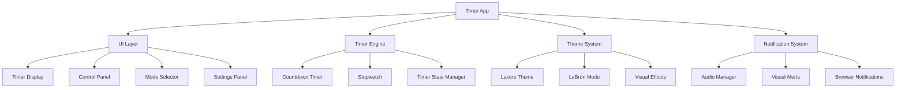

# Design Document: Lakers Timer App

## Overview

The Lakers Timer App is a web-based application that combines practical timing functionality with immersive LA Lakers and LeBron James theming. The app provides both countdown timer and stopwatch capabilities while delivering an authentic Lakers experience through official colors, branding, quotes, and achievements.

The application will be built as a responsive web app using modern web technologies, ensuring compatibility across mobile, tablet, and desktop devices. The design emphasizes visual appeal, smooth animations, and intuitive user interactions while maintaining the Lakers' premium brand aesthetic.

## Architecture

The application follows a component-based architecture with clear separation of concerns:



### Core Layers

1. **UI Layer**: Handles all visual components and user interactions
2. **Timer Engine**: Manages timing logic and state transitions
3. **Theme System**: Provides Lakers branding and LeBron-specific content
4. **Notification System**: Handles audio and visual feedback

## Components and Interfaces

### Timer Engine Components

**TimerState Interface**
```typescript
interface TimerState {
  mode: 'countdown' | 'stopwatch'
  isRunning: boolean
  isPaused: boolean
  currentTime: number // milliseconds
  targetTime?: number // for countdown mode
  startTime: number
}
```

**Timer Controller**
- Manages timer state transitions (start, pause, resume, reset)
- Provides time formatting utilities
- Handles timer completion events
- Maintains precision timing using requestAnimationFrame

**Countdown Timer Component**
- Accepts duration input in minutes/seconds
- Counts down to zero with millisecond precision
- Triggers completion events when reaching zero
- Supports preset durations (5, 10, 15, 23, 30 minutes)

**Stopwatch Component**
- Counts up from zero with millisecond precision
- Supports lap time recording
- Maintains running total and split times
- Provides reset functionality

### UI Components

**Timer Display**
- Large, prominent time display using Lakers fonts
- Smooth animations for time transitions
- Progress indicators (circular progress for countdown)
- Lakers purple and gold color scheme

**Control Panel**
- Start/Pause/Resume buttons with Lakers styling
- Reset button with confirmation
- Mode toggle (Countdown ↔ Stopwatch)
- Preset timer buttons (5min, 10min, 15min, 23min, 30min)

**Input Controls**
- Time picker for countdown duration
- Numeric input with validation
- Touch-friendly controls for mobile devices
- Keyboard shortcuts support

**Settings Panel**
- Volume control for notifications
- Sound selection (Lakers-themed audio)
- LeBron Mode toggle
- Visual theme customization

### Theme System Components

**Lakers Theme Manager**
- Official color palette implementation
- Lakers logo and imagery integration
- Typography matching Lakers branding
- Responsive layout system

**LeBron Mode Features**
- Motivational quotes rotation system
- Career achievements display
- Jersey number presets (6, 23 minutes)
- Championship banners background
- Career highlights on milestone timers

**Visual Effects Engine**
- Smooth CSS animations and transitions
- Particle effects for timer completion
- Gradient backgrounds with Lakers colors
- Responsive animations that scale with device

## Data Models

### Timer Configuration
```typescript
interface TimerConfig {
  id: string
  name: string
  duration: number // milliseconds
  isPreset: boolean
  category: 'workout' | 'study' | 'break' | 'custom'
}
```

### LeBron Content
```typescript
interface LeBronQuote {
  id: string
  text: string
  context?: string
  year?: number
}

interface LeBronAchievement {
  id: string
  title: string
  description: string
  year: number
  team: string
  category: 'championship' | 'award' | 'record' | 'milestone'
}
```

### User Preferences
```typescript
interface UserPreferences {
  volume: number // 0-100
  selectedSound: string
  lebronModeEnabled: boolean
  defaultTimerMode: 'countdown' | 'stopwatch'
  favoritePresets: string[]
}
```

### Notification Settings
```typescript
interface NotificationConfig {
  audioEnabled: boolean
  visualEnabled: boolean
  browserNotifications: boolean
  soundTheme: 'classic' | 'arena' | 'championship'
}
```
## Correctness Properties

*A property is a characteristic or behavior that should hold true across all valid executions of a system—essentially, a formal statement about what the system should do. Properties serve as the bridge between human-readable specifications and machine-verifiable correctness guarantees.*

### Timer Functionality Properties

**Property 1: Countdown Timer Accuracy**
*For any* valid countdown duration, starting the timer should result in the displayed time decreasing continuously until reaching zero
**Validates: Requirements 1.1**

**Property 2: Timer Completion Notifications**
*For any* timer that reaches completion (countdown to zero), the notification system should trigger both audio and visual alerts
**Validates: Requirements 1.2, 4.1, 4.3**

**Property 3: Stopwatch Increment Accuracy**
*For any* stopwatch session, starting the timer should result in the displayed time increasing continuously from zero
**Validates: Requirements 1.3**

**Property 4: Pause and Resume Consistency**
*For any* timer in any state, pausing should preserve the current time value, and resuming should continue from that exact time
**Validates: Requirements 1.4**

**Property 5: Time Format Display Rules**
*For any* time duration, the display format should be MM:SS for durations under 60 minutes and HH:MM:SS for durations of 60 minutes or longer
**Validates: Requirements 1.5**

### Visual Theme Properties

**Property 6: Lakers Color Scheme Compliance**
*For any* rendered interface element, the primary colors used should include Lakers purple (#552583) and gold (#FDB927)
**Validates: Requirements 2.1**

**Property 7: Lakers Branding Elements Presence**
*For any* interface screen, Lakers logo and imagery elements should be present and visible
**Validates: Requirements 2.2, 3.4**

**Property 8: Typography Consistency**
*For any* text element in the interface, the font family should match Lakers branding aesthetic standards
**Validates: Requirements 2.3**

**Property 9: Animation State Correlation**
*For any* running timer, Lakers-themed visual animations and effects should be active and visible
**Validates: Requirements 2.4**

**Property 10: Visual Consistency Across Components**
*For any* two interface components, they should maintain consistent styling patterns including colors, fonts, and spacing
**Validates: Requirements 2.5**

### LeBron Mode Properties

**Property 11: Quote Display on Completion**
*For any* completed timer, a LeBron motivational quote should be randomly selected and displayed from the predefined quote collection
**Validates: Requirements 3.1**

**Property 12: LeBron Mode Content Display**
*For any* interface with LeBron Mode enabled, career achievements and statistics should be visible in the interface
**Validates: Requirements 3.2**

**Property 13: Jersey Number Presets in LeBron Mode**
*For any* timer preset selection with LeBron Mode enabled, options for 6-minute and 23-minute timers should be available
**Validates: Requirements 3.3**

**Property 14: Milestone Content Triggering**
*For any* timer reaching milestone durations (multiples of 6 or 23 minutes), LeBron career highlights or facts should be displayed
**Validates: Requirements 3.5**

### User Interface Properties

**Property 15: Input Method Availability**
*For any* countdown timer setup, input controls for both minutes and seconds should be present and functional
**Validates: Requirements 5.1**

**Property 16: Control Button Visibility**
*For any* timer interface, start, pause, and reset buttons should be prominently displayed and meet minimum size requirements
**Validates: Requirements 5.2**

**Property 17: Mode Switching Functionality**
*For any* timer mode change request, the interface should successfully switch between countdown and stopwatch modes
**Validates: Requirements 5.3**

**Property 18: Preset Timer Options**
*For any* timer setup interface, preset options for common durations (5, 10, 15, 23, 30 minutes) should be available
**Validates: Requirements 5.4**

**Property 19: Progress Indicator Visibility**
*For any* running timer, visual progress indicators should be displayed and update in real-time
**Validates: Requirements 5.5**

### Audio and Notification Properties

**Property 20: Volume Control Effectiveness**
*For any* volume adjustment, the audio notification level should change proportionally to the volume setting
**Validates: Requirements 4.2**

**Property 21: Sound Customization Options**
*For any* notification sound selection interface, multiple Lakers-themed audio options should be available for user selection
**Validates: Requirements 4.4**

### Responsive Design Properties

**Property 22: Mobile Layout Adaptation**
*For any* mobile viewport size (width < 768px), the interface layout should adapt to fit the screen appropriately
**Validates: Requirements 6.1**

**Property 23: Tablet Layout Optimization**
*For any* tablet viewport size (768px ≤ width < 1024px), the interface should maintain full functionality and visual appeal
**Validates: Requirements 6.2**

**Property 24: Desktop Experience Quality**
*For any* desktop viewport size (width ≥ 1024px), the interface should provide an optimal user experience
**Validates: Requirements 6.3**

**Property 25: Orientation Change Responsiveness**
*For any* screen orientation change event, the layout should adjust appropriately to the new orientation
**Validates: Requirements 6.4**

**Property 26: Touch Target Sizing**
*For any* interactive element, the touch target size should meet minimum accessibility requirements (44px × 44px)
**Validates: Requirements 6.5**

## Error Handling

### Timer Error Scenarios

**Invalid Input Handling**
- Negative duration values should be rejected with user-friendly error messages
- Non-numeric input should be sanitized or rejected
- Duration exceeding maximum limits (24 hours) should be capped with warnings

**Timer State Conflicts**
- Attempting to start an already running timer should be handled gracefully
- Multiple rapid start/stop commands should be debounced to prevent state corruption
- Browser tab visibility changes should not break timer functionality

**Audio System Failures**
- Audio playback failures should fall back to visual-only notifications
- Missing audio files should use default system sounds
- Audio permission denials should inform users and provide alternatives

### Network and Resource Errors

**Asset Loading Failures**
- Missing Lakers imagery should fall back to color-based theming
- Font loading failures should use system font fallbacks
- LeBron content loading errors should use cached or default content

**Browser Compatibility Issues**
- Unsupported browser features should degrade gracefully
- Local storage failures should use session storage or memory fallbacks
- Animation performance issues should reduce complexity automatically

## Testing Strategy

### Dual Testing Approach

The Lakers Timer App will employ both unit testing and property-based testing to ensure comprehensive coverage and correctness validation.

**Unit Tests** will focus on:
- Specific timer duration examples (5 minutes, 23 minutes, 1 hour)
- Edge cases (zero duration, maximum duration, rapid state changes)
- Error conditions (invalid inputs, audio failures, network issues)
- Integration points between timer engine and UI components
- LeBron Mode activation and content display
- Responsive breakpoint transitions

**Property-Based Tests** will verify:
- Universal timer behavior across all valid durations and states
- Visual consistency across all viewport sizes and orientations
- Audio notification behavior across all volume levels and sound selections
- Theme compliance across all interface components
- User interaction patterns across all input methods

### Property-Based Testing Configuration

The testing framework will use **fast-check** for JavaScript property-based testing with the following configuration:
- Minimum **100 iterations** per property test to ensure comprehensive input coverage
- Each property test will be tagged with: **Feature: lakers-timer-app, Property {number}: {property_text}**
- Custom generators for timer durations, viewport sizes, and user interaction sequences
- Shrinking enabled to find minimal failing examples when properties fail

### Test Categories

**Timer Engine Tests**
- Countdown accuracy across random durations (1 second to 24 hours)
- Stopwatch precision across random time intervals
- Pause/resume consistency across random timing scenarios
- State transition validation across all possible timer states

**UI Component Tests**
- Visual rendering across random viewport dimensions
- Color compliance across all interface elements
- Typography consistency across all text components
- Animation behavior across all timer states

**Integration Tests**
- End-to-end timer workflows from setup to completion
- LeBron Mode activation and content integration
- Audio notification system integration
- Responsive design behavior across device types

**Performance Tests**
- Timer accuracy under high CPU load
- Animation smoothness across different devices
- Memory usage during extended timer sessions
- Battery impact on mobile devices

Each property test will reference its corresponding design document property and validate the specific requirements it covers, ensuring traceability from requirements through design to implementation verification.